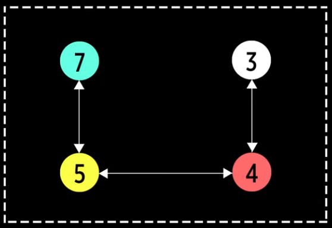
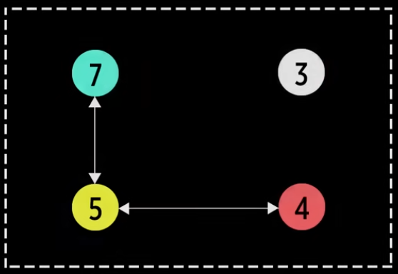

# Graphs

Ориентированный граф - все ребра имеют какое-то конкретное направление

Неориентированный граф - каждое ребро имеет два направления

Связый граф - все узлы соеденены ребрами

Несвязный граф - хотя бы одна пара узлов не соеденена ребрами

У графа не обязательно должен быть один родитель, соответственно, ребер тоже

Инцидентность - понятие используемое только в отношении ребра и вершины, две вершины или два ребра инцидентными быть не могут

A--------B , здесь узел А инцидентен ребру, узел В так же инцидентен ребру

тоесть инцидентность, это концевая вершина для ребра

Смежность - понятие используемое в отношении только двух ребер либо только двух вершин:
два ребра, инцидентные одной вершине, называются смежными, две вершины, инцидентные одному ребру, так же называются смежными

А-----В------С , здесь ребра между АВ и ВС инциденты узлу В, значит, они смежные

так же узел А и узел В инцидентны ребру между ними, они так же смежные

Степень вершины - количество ребер инцидентных этой вершине (выходящих из этого узла)

Вершины могут быть четными и нечетными

Двунаправленное ребро можно заменить двумя дугами (2 однонаправленных ребра, направленных в разные стороны)

Кратные ребра - ребра, которые парно соединяют две вершины (дугами)

Если граф допускает кратные ребра, он называется мультиграф

Петля - ребро, которое начинается и заканчивется на одной вершине (исходит из нее и ссылается так же на нее)

Если граф допускает кратные ребра и петли, то он называется псевдограф

Матрица смежности:
  А Б В Г
А 0 1 0 1
Б 1 0 1 0
В 0 1 1 1
Г 1 0 1 0

каждый столбец и строка - имена вершин графа
есил вершина А смежна с вершиной Б, ставим 1

Если ребра графа имеют вес, то есть
Весовая матрица:
  А Б В Г
А   4   1
Б 4   3 
В   3 2 6
Г 5  6

здесь число это вес и значит там есть ребро, если пуста, ребра нет
